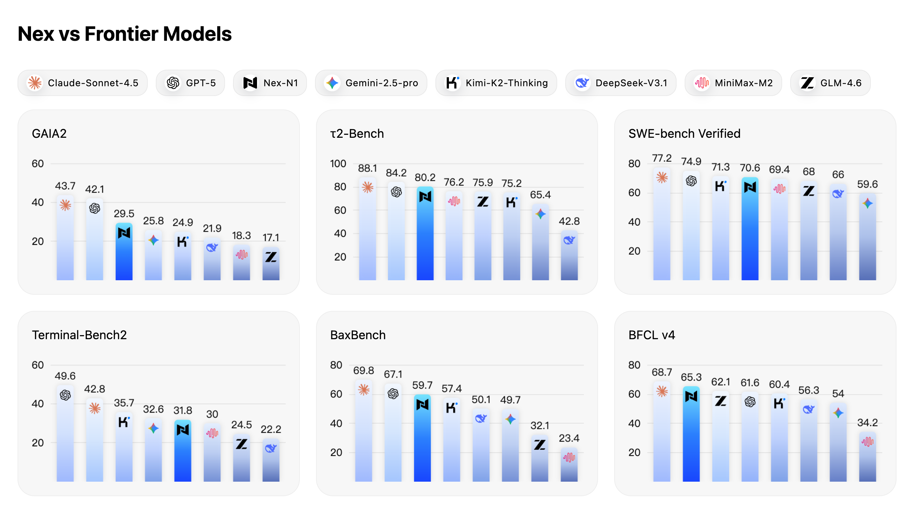
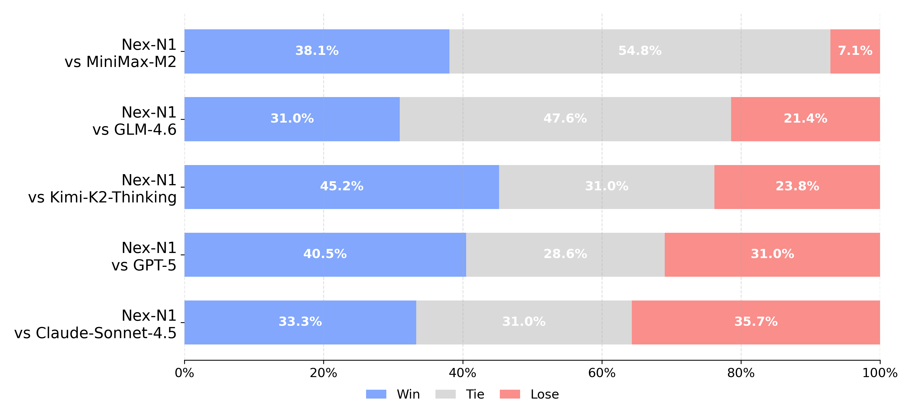
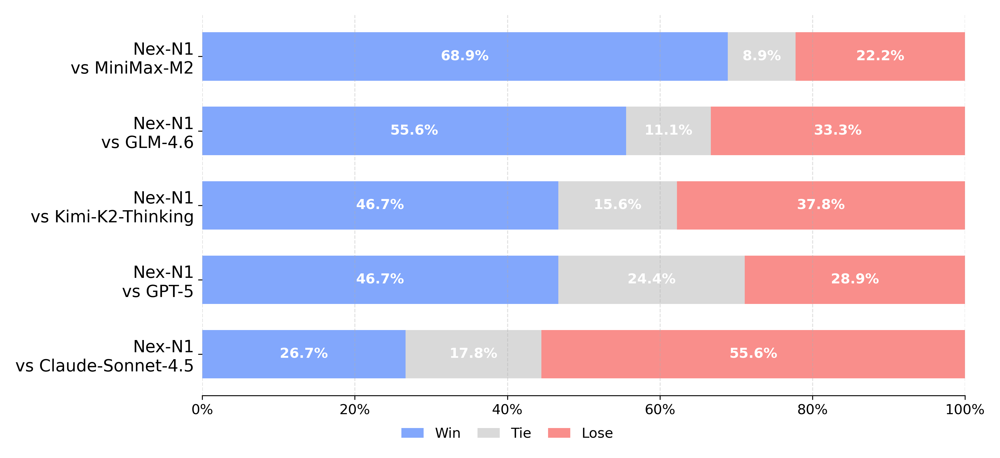

<div align="center">
  
</div>

---

<div align="center">
🏠 <a href="https://nex.sii.edu.cn"><b>Home&nbspPage</b></a>&nbsp&nbsp | &nbsp&nbsp
🤗 <a href="https://hf.co/collections/nex-agi/nex-n1"><b>Model</b></a>&nbsp&nbsp | &nbsp&nbsp
🤗 <a href="https://huggingface.co/datasets/nex-agi/agent-sft"><b>Data</b></a>&nbsp&nbsp | &nbsp&nbsp
📑 <a href=""><b>Tech&nbspReport&nbsp(Coming&nbspSoon)</b></a>&nbsp&nbsp
</div>

# Nex-N1

Nex is a next-generation, full-stack agentic platform that brings foundation models, synthetic data pipelines, RL training, agent frameworks, and deployment tools together in one unified ecosystem.
DeepSeek-V3.1-Nex-N1 is the flagship release of the Nex-N1 series — a post-trained model designed to highlight agent autonomy, tool use, and real-world productivity.
We are committed to making it easier than ever to build and deploy AI agents by offering researchers and entrepreneurs a high-performance, reliable, and cost-effective "out-of-the-box" agent system.

## Highlights

- **Full spectrum model matrix:** From 8B to 671B parameters, the Nex series covers everything from edge-friendly setups to frontier-scale deployments.
- **Agent-focused performance:** Demonstrates industry-leading results on programming, tool-use, web-search, and other multi-hop reasoning tasks.
- **Production-ready utility:** Excels at mini-app development, website authoring, slide creation, and immersive role-play—delivering immediate productivity
gains.
- **End-to-end control:** Developers can build the entire data-to-deployment loop on top of Nex, ensuring sovereignty while keeping costs predictable.
- **Open ecosystem:** Turnkey synthetic data pipelines, curated datasets, Nex-N1 checkpoints, the NexAU Agent framework, the EaaS MoE inference stack, and NexRL
training services are all openly available.

## Performance

Nex-N1 is evaluated on six representative agentic benchmarks (general + professional). The model consistently ranks at or near the top across tool-using, web-search, and coding-heavy evaluations, showing strong readiness for real-world agent workflows.



<ul align="left" style="font-size:12px; color:#6c757d;">
  <li>Data points are sourced by default from the model’s official technical report or blog, as well as the benchmark’s official results. All other metrics were tested in strict compliance with the official standard evaluation framework.</li>
  <li>Results for Tau2-bench are derived via a weighted average.</li>
  <li>For SWE-verified-bench, test results are based on an internal scaffold built with OpenHands—using a 128k context length and 150 maximum steps—and represent the average of four runs.</li>
  <li>Terminal-Bench2 is evaluated using the official Terminus2 agent.</li>
</ul>

Nex-N1 provides various size models from 8B to 671B for different usage scenarios.

| Model | GAIA2 | τ2-Bench | SWE-bench Verified | Terminal-Bench2 | BaxBench | BFCL v4 |
| --- | --- | --- | --- | --- | --- | --- |
| [DeepSeek-V3.1-Nex-N1](https://huggingface.co/nex-agi/DeepSeek-V3.1-Nex-N1) | 29.5 | 80.2 | 70.6 | 31.8 | 59.7 | 65.3 |
| [Qwen3-32B-Nex-N1](https://huggingface.co/nex-agi/Qwen3-32B-Nex-N1) | 16.7 | 72.1 | 50.5 | 16.7 | 34.8 | 60.5 |
| [Qwen3-30B-A3B-Nex-N1](https://huggingface.co/nex-agi/Qwen3-30B-A3B-Nex-N1) | 11.3 | 65.3 | 29.7 | 8.3 | 13.6 | 51.9 |
| [internlm3-8B-Nex-N1](https://huggingface.co/nex-agi/internlm3-8B-Nex-N1) | 8.6 | 63.0 | 20.3 | - | - | 44.5 |

Nex-N1 demonstrates competitive performance across all evaluation scenarios, showing particularly strong results in practical coding and HTML generation tasks.

<div align="center">
  
  <div>Practical Coding Evaluation</div>
</div>

<div align="center">
  
  <div>HTML Generation Evaluation</div>
</div>

Refer to <https://huggingface.co/datasets/nex-agi/coding-eval> and  <https://huggingface.co/datasets/nex-agi/html-eval> for more details.

## Usage

### Local Deployment

We recommend `sglang` for serving Nex-series models locally:

```bash
python -m sglang.launch_server --model-path /path/to/your/model
```

### Function Calling

Nex-series models support robust function-calling capabilities. To maximize the function-calling capabilities of the Nex-series models, we modified the tool parser of `qwen3_coder`, see: <https://github.com/sgl-project/sglang/pull/13411>. To enable this feature, simply add the `--tool-call-parser qwen3_coder` flag when launching the server:

```bash
python -m sglang.launch_server --model-path /path/to/your/model --tool-call-parser qwen3_coder
```

### Mini Program Development

Nex-N1 is optimized for mini program development. For optimal performance, we recommend using Claude Code configured with both `context7` and a search MCP.

```shell
claude mcp add --transport http context7 https://mcp.context7.com/mcp --header "CONTEXT7_API_KEY: [CONTEXT7_API_KEY]"

claude mcp add --transport stdio serper-search --env SERPER_API_KEY=[SERPER_API_KEY]  -- npx -y serper-search-scrape-mcp-server
```

Refer to <https://github.com/upstash/context7> for more details on setting up `context7`.
